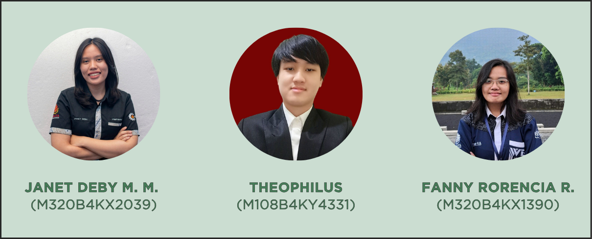

# 🤖Machine Learning🤖

## 📚 Developers



## 📖 Table Of Content
- [📚 Developers](#📚-developers)
- [📂 Directory](#📂-directory)
- [🏗️ Project Structure](#️🏗️-project-structure)
- [💻 Installation](#💻-installation)
- [🖥️ Use the Virtual Environment in VS Code](#️🖥️-use-the-virtual-environment-in-vs-code)
- [📥 Input and Output Description](#📥-input-and-output-description)
- [🔄 General Workflow](#🔄-general-workflow)
- [📦 Using Pre-trained Models](#📦-using-pre-trained-models)
- [🏋️ Train the Models](#🏋️-train-the-models-optional) (Optional)
- [📊 Evaluate the Models](#📊-evaluate-the-models)
- [🔮 Prediction](#🔮-prediction)
- [🔗 Links](#🔗-links)

## 📂 Directory
<pre>
│  README.md
│  requirements.txt
│  modelBMI_v1.ipynb
│  model_v3_acc_98.04_loss_0.33.keras
│  model_v3.ipynb
│  bmi_model-accuracy_0.90-loss_0.26-val_accuracy_0.91-val_loss_0.23.keras
│  .gitignore
│
├─saved_models_v3_image_2
│  ├─weights-improvment-01-2.50.keras
│  ├─weights-improvment-02-1.66.keras
│  ├─...
│  └─weights-improvment-15-0.33.keras
│
├─processed_dataset
│  ├─wortel
│  ├─udang
│  ├─...
│  └─ayam
│     ├─ayam0.jpg
│     └─...
│
├─dataset_split
│  ├─wortel
│  ├─udang
│  ├─...
│  └─ayam
│     ├─ayam0.jpg
│     └─...
│
├─dataset
│  ├─test
│  ├─train
│  └─validation
│     ├─wortel
│     ├─udang
│     ├─...
│     └─ayam
│        ├─ayam0.jpg
│        └─...
│
├─csv
│  ├─bmi_validation.csv
│  ├─bmi_train.csv
│  └─bmi.csv
│
└─assets
   ├─developers.png
   └─...
</pre>

## 🏗️ Project Structure
- **`modelBMI_v1.ipynb`**: Jupyter Notebook for training or using the BMI model.
- **`model_v3.ipynb`**: Jupyter Notebook for training or using the image classification model.
- **`model_v3_acc_98.04_loss_0.33.keras`**: Pre-trained model for image classification.
- **`bmi_model-accuracy_0.90-loss_0.26-val_accuracy_0.91-val_loss_0.23.keras`**: Pre-trained BMI prediction model.
- **`saved_models_v3_image_2/`**: Checkpoints for the image classification model.
- **`processed_dataset/`**: Preprocessed datasets grouped by class (e.g., wortel, udang).
- **`dataset_split/`**: Splitted dataset to train, test, and validation from dataset directory.
- **`dataset/`**: Original dataset through image scraping from Google Images.
- **`csv/`**: CSV files containing BMI-related data for training and validation from kaggle.
- **`assets/`**: Image and other asset files.

## 💻 Installation
### 1. Clone The Repositories
#### Clone using the web URL.
```
git clone https://github.com/NYAM-Food-App/Machine-Learning.git
```
#### Using GitHub official CLI.
```
gh repo clone NYAM-Food-App/Machine-Learning
```
**Recommended IDE:** Visual Studio Code
### 2. Setup Environment
#### Setup Environment - Anaconda
```
conda create --name nyam-ml python=3.12.7
conda activate nyam-ml
pip install -r requirements.txt
```

#### Setup Environment - Shell/Terminal
```
mkdir Machine-Learning
cd Machine-Learning
pipenv install
pipenv shell
pip install -r requirements.txt
```

## 🖥️ Use the Virtual Environment in VS Code

If you want to run the project in **VS Code**, make sure you configure VS Code to use the virtual environment you created. Follow these steps:

### 1. **Select the Virtual Environment in VS Code**
1. Open the project folder in VS Code.
2. Press **Ctrl + Shift + P** (Windows/Linux) or **Cmd + Shift + P** (Mac) to open the Command Palette.
3. Type and select **Python: Select Interpreter**.
4. From the list, select the interpreter that corresponds to your virtual environment (e.g., `nyam-ml`).  
   It should look something like this:
   ```
   (base) .../anaconda3/envs/nyam-ml/bin/python
   ```
---

### 2. **Run Notebooks in the Virtual Environment**
1. Open a Jupyter Notebook file (e.g., `modelBMI_v1.ipynb` or `model_v3.ipynb`).
2. At the top right of the notebook interface, click on the kernel name (or "Select Kernel").
3. Choose the interpreter that corresponds to your virtual environment.

3. If you haven't created the environment yet, follow the steps in the [**Setup Environment**](#2-setup-environment) section above to create and activate it.

## 📥 Input and Output Description

### 1. **BMI Prediction Model**
- **Input**:  
  A CSV file containing the following columns:
  - `gender` (e.g., "0" for Male or "1" for female)
  - `height` (in cm)
  - `weight` (in kg)
  - `BMI` (weight) / (height ^ 2) * 10,000

  
  
  Example:
  ```csv
  gender,   height,  weight,  BMI
  0,        170,     70,      24.22
  1,        160,     55,      21.48
  ```

- **Output**:  
  There are 6 label BMI value for each row from 0 to 5.
   * 0 - Extremely Weak
   * 1 - Weak
   * 2 - Normal
   * 3 - Overweight
   * 4 - Obesity
   * 5 - Extreme Obesity  

---

### 2. **Image Classification Model**
- **Input**:  
  Image files of food items (e.g., `ayam0.jpg`, `wortel1.jpg`). The images should be in the appropriate dataset directory structure or loaded individually for prediction.

  Use this code if you want to upload image for test (this code already in the ipynb file):
  ```python
   import numpy as np
   import cv2
   from io import BytesIO
   import ipywidgets as widgets
   from IPython.display import display
   import tensorflow as tf
   
   IMG_SIZE = (224, 224)

   # File upload widget
   uploader = widgets.FileUpload(accept="image/*", multiple=True)
   display(uploader)
   out = widgets.Output()
   display(out)

   # Image preprocessing function
   def ImagePreprocess1(file_stream):
      # Read the image from a BytesIO object
      file_stream.seek(0)  # Ensure the pointer is at the beginning of the stream
      file_bytes = np.frombuffer(file_stream.read(), np.uint8)  # Read binary data into a numpy array
      image = cv2.imdecode(file_bytes, cv2.IMREAD_COLOR)  # Decode image
      
      # Convert BGR to RGB and resize
      img_rgb = cv2.cvtColor(image, cv2.COLOR_BGR2RGB)
      img_resize = cv2.resize(img_rgb, IMG_SIZE)

      # Create the sharpening kernel
      kernel = np.array([[0, -1, 0], [-1, 5, -1], [0, -1, 0]])

      # Sharpen the image
      sharpened_image = cv2.filter2D(img_resize, -1, kernel)
      return sharpened_image

   # File prediction function
   def file_predict(filename, file, out):
      try:
         # Preprocess the image using ImagePreprocess1
         processed_image = ImagePreprocess1(file)
         processed_image = np.expand_dims(processed_image, axis=0)  # Add batch dimension

         # Predict using the model
         prediction = model.predict(processed_image, verbose=0)[0]

         with out:
               print(f'\nModel output: {prediction}')
               prediction_index = np.argmax(prediction)
               classes = ["ayam", "brokoli", "ikan", "kambing", "kembang kol", "kentang", "kol", "labu", "mentimun", "paprika", "sapi", "tahu", "telur", "tempe", "tomat", "udang", "wortel"]
               predicted_class = classes[prediction_index]
               print(f'{filename} is {predicted_class}')
      except Exception as e:
         with out:
               print(f"Error processing {filename}: {str(e)}")

   # File upload change handler
   def on_upload_change(change):
      items = change.new  # 'new' contains a dictionary of uploaded files
      for filename, file_info in items.items():  # Loop through uploaded files
         try:
               # Extract file content and pass it for prediction
               file_content = file_info['content']
               file_jpgdata = BytesIO(file_content)
               file_predict(file_info['metadata']['name'], file_jpgdata, out)
         except Exception as e:
               with out:
                  print(f"Error processing file: {str(e)}")

   # Observe the file upload widget for changes
   uploader.observe(on_upload_change, names='value')
  ```

- **Output**:  
  - There are 17 predicted ingredient foods class (e.g., "Chicken", "Carrot", "Shrimp").
  - The model's confidence score from 0 to 1 for each class (e.g., `{Chicken: 0.98, Carrot: 0.01, Shrimp: 0.01}`).

### 🔄 General Workflow
```bash
# BMI Prediction
1. Prepare a CSV file with gender, height, and weight.
2. Run the `modelBMI_v1.ipynb` notebook.
3. Load the CSV file and run the prediction cells.
4. Output: A CSV file with BMI and classification results.

# Image Classification
1. Place your test images in the `dataset/test/` directory.
2. Run the `model_v3.ipynb` notebook.
3. Select an image or a batch of images for prediction.
4. Output: Predicted classes and confidence scores.
```


## 📦 Using Pre-trained Models

1. **For BMI Prediction:**
   - Open the `modelBMI_v1.ipynb` notebook.
   - Load the pre-trained model:
     ```python
     from tensorflow.keras.models import load_model
     model = load_model('bmi_model-accuracy_0.90-loss_0.26-val_accuracy_0.91-val_loss_0.23.keras')
     ```
   - Follow the notebook instructions to test the model with your BMI data in `csv/bmi.csv`.

2. **For Image Classification:**
   - Open the `model_v3.ipynb` notebook.
   - Load the pre-trained model:
     ```python
     from tensorflow.keras.models import load_model
     model = load_model('model_v3_acc_98.04_loss_0.33.keras')
     ```
   - Follow the notebook instructions to classify images in the `dataset/test/` directory.

## 🏋️ Train the Models (Optional)

1. **BMI Model:**
   - Use the `modelBMI_v1.ipynb` notebook.
   - Update the `csv/bmi_train.csv` and `csv/bmi_validation.csv` files if you want to use new data.

2. **Image Classification Model:**
   - Use the `model_v3.ipynb` notebook.
   - Update the `dataset/train/` and `dataset/validation/` directories with new data.
   - Modify the training parameters as needed.

## 📊 Evaluate the Models

1. **Run the evaluation cells in the notebooks** (`modelBMI_v1.ipynb` or `model_v3.ipynb`) to see the models' performance on the test datasets.

## 🔮 Prediction

1. **For BMI:**
   - Run the prediction cells in `modelBMI_v1.ipynb`.

2. **For Images:**
   - Run the prediction cells in `model_v3.ipynb`.

## 🔗 Links
#### GitHub
* [GitHub - NYAM-Food-App](https://github.com/NYAM-Food-App)
* [GitHub - Machine Learning](https://github.com/NYAM-Food-App/Machine-Learning)
#### LinkedIn
* [Janet Deby Marlien Manoach](https://www.linkedin.com/in/deby-manoach/)
* [Fanny Rorencia Ribowo](https://www.linkedin.com/in/fanny-rorencia-ribowo-27390b228/)
* [Theophilus](https://www.linkedin.com/in/theophilus-a3567a331/)
#### Kaggle
* [BMI - Body Mass Index](https://www.kaggle.com/datasets/sjagkoo7/bmi-body-mass-index)
* [BMI Dataset](https://www.kaggle.com/datasets/yasserh/bmidataset?resource=download)
